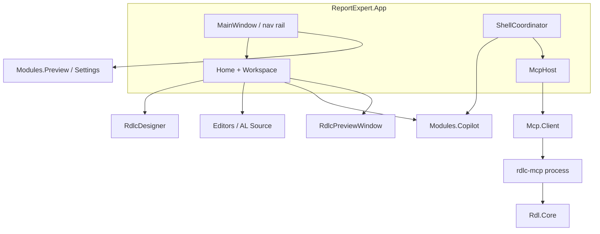

# Architecture

Report Expert is a **modular WPF desktop application** (.NET 10) with one shell and feature modules. The live shell hosts **Home** and **Settings**. RDLC data preview opens as a window from Home (not a navigation tab).

A developer who has never seen this repo should be able to answer: *where does my change belong?* That is the goal of this page. It is not a Clean Architecture rewrite.

## Goals

- Keep UI features isolated in modules
- Share RDLC domain models without circular dependencies
- Let the App shell own cross-module orchestration
- Preserve working Preview / Copilot behavior while library layers mature

## High-level diagram



```
┌──────────────────────────────────────────────────────────────┐
│                 ReportExpert.App (shell)                      │
│  MainWindow · nav rail · Home · Workspace · ShellCoordinator  │
└──────────────────────────┬───────────────────────────────────┘
                           │
                      Settings (Preview module)
                           │
         Home → RdlcPreviewWindow (on demand)
         Workspace (side explorer)
         Copilot panel (embedded on Home)
```

## Runtime vs scaffolding

| Layer | Status | Notes |
|-------|--------|-------|
| App + Preview + Copilot + Editors | **Live** | Used by the shipping UI |
| Domain + Core + Common | **Live** | Contracts and shared models — **only some types** are consumed (see below) |
| Application / Infrastructure / Plugins / Shared | **Scaffolding** | DI/plugin patterns prepared; App still constructs services manually |
| `ReportExpert.Reporting.*` | **Parallel libraries** | Parser covered by tests; Preview keeps its own live implementations |
| Localization module | **In solution** | Not wired into shell navigation yet |

**Do not delete scaffolding casually** — document intent and migrate callers first. Consolidation onto `Reporting.*` is planned technical debt (see [Roadmap.md](Roadmap.md) and [CLEANUP_REVIEW.md](CLEANUP_REVIEW.md)).

**Contributor trap:** a change that compiles against `ReportExpert.Application` or `Reporting.Parser` will **not** run in the app until App references those projects. Edit the **live** Preview / Copilot / App types unless you are doing the consolidation.

### Core / Domain types the App actually uses

- **Used:** editor interfaces (`IAlSource*`, `IEditorThemeService`, …), `IWorkspaceService`, workspace DTOs in Domain, `AppConstants` / `ThemeNames`
- **Not used by App:** `ISettingsService`, `IRdlcMetadataParser`, `IDummyDataGenerator`, `IReportExportService`, `ModuleCatalog`, `ShellBuilder`, Domain `AppSettings` / RDLC metadata (Preview has its own)

## Module responsibilities

| Project | Role | In shell nav |
|---------|------|--------------|
| `ReportExpert.App` | Entry, Home, Workspace, navigation, events | Yes |
| `ReportExpert.Modules.Preview` | RDLC preview window, sample data, ReportViewer, export, Settings | Settings; preview via Home |
| `ReportExpert.Modules.Copilot` | Multi-provider AI chat, agent loop, tool approval | Embedded on Home |
| `ReportExpert.Modules.Localization` | Label/CSV editor | No (not wired) |
| `ReportExpert.Editors` | AL Source (AvalonEdit + TextMate) | Used by Home |
| `ReportExpert.RdlcDesigner` | Minimal clean-room RDLC layout editor | Hosted on Home |
| `ReportExpert.Rdl.Core` | RDL parse / edit / validate for the MCP server | No (library) |
| `ReportExpert.Rdl.Mcp.Server` | `rdlc-mcp` — MCP server over stdio | No (child process) |
| `ReportExpert.Mcp.Client` | MCP client abstraction consumed by the shell | No (library) |

## Where to add a new feature

| If you want to… | Put it in… | Avoid… |
|-----------------|------------|--------|
| Change Home, nav, workspace, how modules talk | `ReportExpert.App` (`ShellCoordinator`) | Calling Preview from Copilot directly |
| Change PDF / sample data / Settings UI | `Modules.Preview` | Editing `Reporting.*` and expecting the UI to follow |
| Change chat, providers, agent loop | `Modules.Copilot` | Referencing `rdlc-mcp` from Copilot (use `IMcpToolGateway`) |
| Add an MCP **tool** for RDLC | `src/mcp/ReportExpert.Rdl.Mcp.Server/Tools` + `Rdl.Core` | Duplicating XML edit logic in the WPF module |
| Add a **new MCP server** (Word, Excel, …) | Config in `mcp-servers.json` + optional new process | Hard-coding the server into Copilot |
| Change the layout designer surface | `ReportExpert.RdlcDesigner` | Copying Microsoft Report Designer binaries |
| Change AL highlighting | `ReportExpert.Editors` | Editing generated TextMate JSON by hand without the script |
| Shared AppData file names / theme ids | `ReportExpert.Common` | Magic strings in a single module |
| Wire Localization into nav | App `ProjectReference` + `MainWindow` | Assuming it already shows up |

## Cross-module integration

`ShellCoordinator` (`src/ReportExpert.App/Shell/ShellCoordinator.cs`) wires workspace, Copilot context, AL path resolution, and preview tools. Modules must not orchestrate each other for shell concerns — the App wires them. Exception today: Preview references Copilot for shared Settings fields.

`McpHost` (`src/ReportExpert.App/Shell/McpHost.cs`) owns the MCP child processes and hands Copilot an `IMcpToolGateway`. The Copilot module depends on that interface, never on the RDLC server, so a new tool server is a configuration entry rather than a reference. See [McpServer.md](McpServer.md).

```mermaid
sequenceDiagram
  participant User
  participant Copilot as CopilotViewModel
  participant Loop as RexAgentLoop
  participant LLM as OpenAiCompatibleClient
  participant MCP as IMcpToolGateway
  participant Disk as rdlc-mcp / disk
  participant Shell as ShellCoordinator

  User->>Copilot: message
  Copilot->>Loop: RunAsync
  Loop->>LLM: chat + tool schemas
  LLM-->>Loop: tool calls
  Loop->>Copilot: approve writes
  Loop->>MCP: CallTool
  MCP->>Disk: edit RDLC
  Disk-->>MCP: envelope
  MCP-->>Loop: tool result
  Loop->>LLM: continue
  LLM-->>Copilot: final reply
  Copilot->>Shell: reload changed files
```

## Standard module layout

```
ReportExpert.Modules.{Name}/
├── Views/
├── ViewModels/
├── Services/
├── Models/
├── Helpers/
└── {Domain}/   # optional
```

## Data flow: RDLC → PDF

1. Home **Preview** opens `RdlcPreviewWindow` for the selected `.rdlc`
2. User chooses **BC XML** or **Sample data**, sets output path
3. `BcXmlReportRenderer` builds `DataTable`s and `LocalReport.Render("PDF")`
4. WebView2 shows the PDF (system viewer fallback if WebView2 is missing)

Details: [RDLCPreviewEngine.md](RDLCPreviewEngine.md), [PDFGeneration.md](PDFGeneration.md).

## Configuration (runtime)

| File | Location | Contents |
|------|----------|----------|
| `settings.json` | `%AppData%\ReportExpert\` | Theme, row count, export folder |
| `recent.json` | `%AppData%\ReportExpert\` | Recent RDLC paths |
| `recent-projects.json` | `%AppData%\ReportExpert\` | Recent project folders |
| `copilot.json` | `%AppData%\ReportExpert\` | Provider, API key, model (**local only**) |
| `mcp-servers.json` | `%AppData%\ReportExpert\` | MCP servers to launch |

Example shapes: [examples/copilot.example.json](examples/copilot.example.json), [examples/mcp-servers.example.json](examples/mcp-servers.example.json). The WPF app does **not** read `.env`; see [`.env.example`](../.env.example).

## Things contributors should not change casually

- **Microsoft Report Designer VSIX / `Microsoft.RdlcDesigner/`** — reference only, not redistributable ([rdlc-designer/MicrosoftPackageReference.md](rdlc-designer/MicrosoftPackageReference.md))
- **MCP tool names and JSON envelopes** — models and tests depend on them
- **AppData file names** in `AppConstants` — existing users have those files
- **Deleting scaffolding projects** — see [CLEANUP_REVIEW.md](CLEANUP_REVIEW.md)
- **Cross-module orchestration** — go through `ShellCoordinator`
- **Secrets** — never commit `copilot.json`, API keys, or customer reports

## Technology stack

| Layer | Choice |
|-------|--------|
| UI | WPF + WPF-UI (Fluent / Mica) |
| MVVM | CommunityToolkit.Mvvm |
| Report rendering | ReportViewerCore (WinForms host) |
| AL editor | AvalonEdit + TextMateSharp |
| Word preview | Open XML SDK → FlowDocument |
| Excel edit | ReoGrid |
| AI | OpenAI-compatible REST |
| Packages | Central Package Management |

## Related docs

- [ProjectStructure.md](ProjectStructure.md)
- [CODEBASE_ANALYSIS.md](CODEBASE_ANALYSIS.md)
- [GETTING_STARTED_CONTRIBUTOR.md](GETTING_STARTED_CONTRIBUTOR.md)
- [AI.md](AI.md)
- [McpServer.md](McpServer.md)
- [modules/](modules/)
