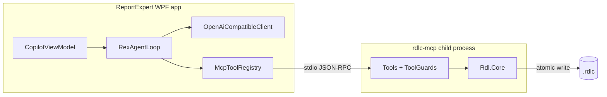

# RDLC MCP server

Report Expert ships a [Model Context Protocol](https://modelcontextprotocol.io) server that exposes
RDLC reports as tools an AI assistant can call. Rex, the built-in Copilot, is one client of it; so is
Claude Desktop, VS Code, or anything else that speaks MCP.

## Projects

| Project | Purpose |
|---------|---------|
| `src/mcp/ReportExpert.Rdl.Core` | RDL document model, XML I/O, readers, editors, validation. No app dependencies. |
| `src/mcp/ReportExpert.Rdl.Mcp.Server` | The `rdlc-mcp` executable: tools, guards, response envelope. |
| `src/mcp/ReportExpert.Mcp.Client` | Provider-agnostic client the app uses to talk to *any* MCP server. |

`Rdl.Core` deliberately takes no dependency on `ReportExpert.Reporting.Parser` or
`ReportExpert.RdlcDesigner`, so the server can be published on its own. `Mcp.Client` has no reference
to the server project either — it launches servers by path from configuration.

## How it fits together



`McpHost` in `ReportExpert.App/Shell` owns the child processes. On first run it writes
`%AppData%\ReportExpert\mcp-servers.json` pointing at the `mcp/rdlc/rdlc-mcp.exe` folder that ships
beside the app (the full server output, not a lone exe). Adding a second MCP server is a config
entry, not a code change.

`McpToolRegistry` prefixes every tool with its server id — `rdl__add_column` — so two servers can
offer a tool of the same name without colliding. The double underscore is deliberate: OpenAI-style
tool names must match `^[a-zA-Z0-9_-]{1,64}$`, which rules out a dot.

## Tools

Thirty-one tools: ten read, twenty-one write.

`describe_rdl_report`, `get_rdl_datasets`,
`get_rdl_parameters`, `get_rdl_columns`, `validate_rdl`, `update_column_header`,
`update_column_width`, `update_column_format`, `add_column`, `remove_column`,
`update_stored_procedure`, `add_dataset_field`, `remove_dataset_field`, `add_parameter` and
`update_parameter`, `get_rdl_tablixes`, `get_rdl_page_setup`, `get_rdl_report_items`,
`find_field_usages`, `move_column`, `set_column_style`, `rename_dataset_field`, `add_dataset`,
`remove_dataset`, `remove_parameter`, `set_page_setup`, `set_textbox_value`,
`set_report_item_visibility`, `remove_report_item`, `list_rdl_backups` and
`restore_rdl_backup`.

## The response envelope

Every tool returns the same shape, whatever happened:

```json
{ "ok": true, "data": { } }
```

```json
{
  "ok": false,
  "error": { "code": "not_found", "message": "...", "hint": "Call get_rdl_datasets to ..." }
}
```

`error.hint` is a required field on the C# type, so a failure can never reach the model without
telling it what to try next. Error codes are `file_not_found`, `invalid_path`, `file_locked`,
`invalid_rdl`, `not_found`, `invalid_argument`, `refused`, `validation_failed`, `resource_limit` and
`internal_error`.

## Safety

Four mechanisms, in the order they apply to a write:

1. **`dry_run`.** Every mutating tool except `restore_rdl_backup` takes `dry_run: true`, applies the
   edit in memory, and returns a unified diff without touching disk.
2. **Approval.** Inside Report Expert, `IToolApprovalService` auto-approves read-only tools and
   prompts before anything that writes. Read the diff, then approve.
3. **Backup.** A timestamped copy goes to a `.rdlc-backups` folder beside the report. The twenty most
   recent are kept; `list_rdl_backups` and `restore_rdl_backup` get them back.
4. **Re-validate, then commit atomically.** The edit is applied to a working copy and validated. An
   edit that would turn a valid report invalid is refused and nothing is written — but a report that
   was *already* invalid stays editable, so it can be repaired. The accepted result is staged in a
   sibling file and moved into place, so an interrupted write cannot leave half a report on disk.
   Access to a given report is serialized by a named mutex, across processes as well as within one.

Because an external process is writing the file, `ShellCoordinator` reloads the document from disk
after a successful mutation. Without that handshake the editor's in-memory copy would silently
clobber the agent's work on the next save.

## Configuration

| Environment variable | Effect |
|---|---|
| `RDLC_MCP_ALLOWED_ROOTS` | Path-separated list of directories the server may open. Unset means no restriction. |
| `RDLC_MCP_BACKUPS` | `false` disables automatic backups. |
| `RDLC_MCP_BACKUP_RETENTION` | Backups kept per report. Defaults to 20. |

Logging goes to stderr, because stdout carries the protocol.

## Using it outside Report Expert

The server packs as a .NET tool with `PackageType=McpServer` and a `.mcp/server.json` manifest:

```bash
dotnet pack src/mcp/ReportExpert.Rdl.Mcp.Server -c Release
```

Any MCP client can then launch it over stdio:

```json
{
  "servers": {
    "rdlc": { "type": "stdio", "command": "rdlc-mcp" }
  }
}
```

Every tool takes `filepath` as its first argument, so no working directory needs configuring.

## Testing

| Project | What it covers |
|---------|----------------|
| `tests/ReportExpert.Rdl.Core.Tests` | Readers, editors, validation and expression parsing against a shared sample report. |
| `tests/ReportExpert.Rdl.Mcp.Server.Tests` | Tool methods called directly: envelope shape, error codes, hint coverage, and a reflection test that every tool appears in the README. |
| `tests/ReportExpert.Mcp.Client.Tests` | End-to-end. Launches the built `rdlc-mcp` executable over stdio and round-trips reads, writes and dry runs. |

## Related

- [Server README](../src/mcp/ReportExpert.Rdl.Mcp.Server/README.md) — the tool table
- [AI.md](AI.md) — how Rex uses these tools
- [ARCHITECTURE.md](ARCHITECTURE.md)
