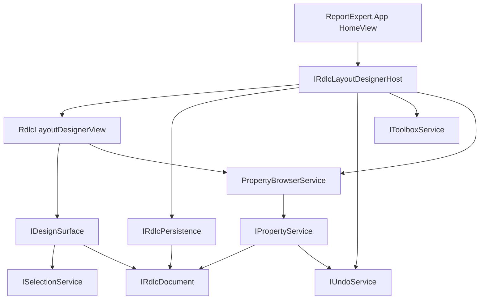

# Clean-room RDLC layout designer

Report Expert ships a **native RDLC layout editor** in `ReportExpert.RdlcDesigner`. It is a clean-room WPF module inspired by service boundaries observed in the Microsoft VSIX (see [MicrosoftPackageReference.md](MicrosoftPackageReference.md)), not a port of Microsoft code.

## Scope

**In scope (current)**

- Professional toolbox (Pointer, TextBox, Rectangle, Line, Image, Table/Matrix/List, Chart, Subreport, Gauge) with original Report Designer icons
- Drag-and-drop creation from toolbox onto the design surface
- Context-sensitive right-click menus (surface + report items + multi-select)
- Selection-aware Properties window via extensible `IPropertyProvider`s
- Datasets / fields browser (bind or insert field textboxes)
- Parameters pane (add / edit / remove)
- Expression editor (fields, parameters, globals)
- Select, move, resize; Ctrl+click multi-select
- Image source / value / MIME; line geometry; tablix cell text editing
- Structure-preserving save; undo / redo

**Still deferred**

- Full chart / gauge / map / tablix structure wizards
- Hosting Microsoft designer DLLs

## Module diagram

## Integration

- Home hosts `IRdlcLayoutDesignerHost.View` in the RDLC designer pane.
- Preview and Copilot continue to use the saved `.rdlc` path on disk.
- Toolbox icons live under `src/ReportExpert.RdlcDesigner/Resources/Icons/`.

## Extensibility

| Extension | Location |
|-----------|----------|
| Toolbox catalog | `Extensibility/IToolboxService`, `ToolboxService` |
| Item creation | `Extensibility/IReportItemFactory`, `DocumentEditService` |
| Property providers | `Properties/IPropertyProvider` + `Properties/Providers/*` |
| Context menus | `ContextMenus/DesignerContextMenuBuilder` |
